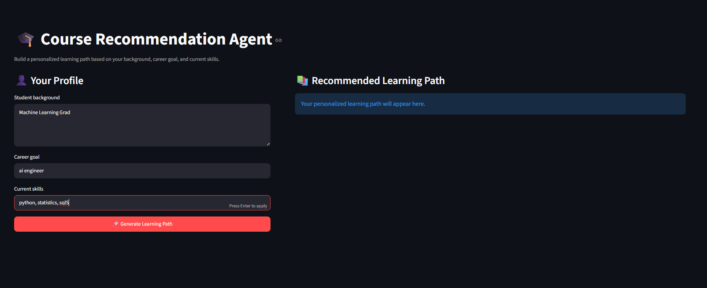
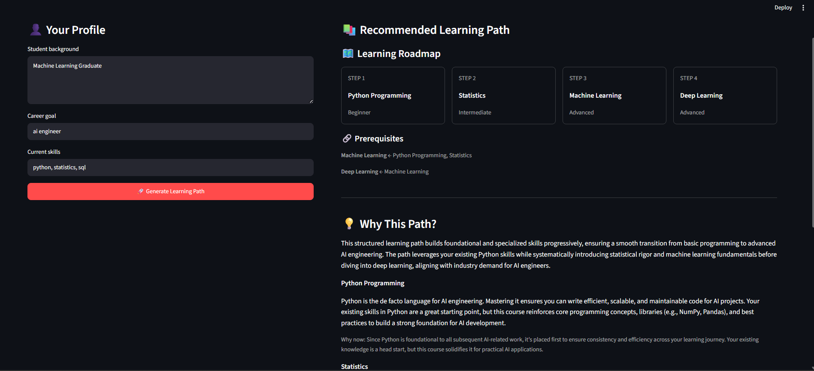

# 🎓 Course Recommendation Agent

An AI-powered course recommendation agent that creates a personalized learning path based on a student's background, career goal, and existing skills.

The system combines a **deterministic recommendation engine** for reliable course selection with an **LLM** for career matching and personalized explanations.

---
## Quick Start

### Requirements

- Python 3.10+
- Mistral API key

### Installation
### 1. Clone
```text
git clone https://github.com/Deepak-G-D/CourseRecommender.git
```

```text
cd course-recommendation-agent
```

### 2. Create virtual environment

```text
python -m venv venv
```
### 3. Activate

Windows:

```text
venv\Scripts\activate
```
macOS/Linux:
```text
source venv/bin/activate
```
### 4. Install dependencies
```text
pip install -r requirements.txt
```
### 5. Configure API key

Windows PowerShell:
```text
$env:MISTRAL_API_KEY="your-api-key"
```
macOS/Linux:
```text
export MISTRAL_API_KEY="your-api-key"
```
### 6. Run
```text
streamlit run streamlit_app.py
```
### 7. Running Tests
```text
python -m pytest
```

## Overview

A student provides:

* Educational/professional background
* Career goal
* Current skills

The agent then:

1. Identifies the target career path.
2. Determines which skills the student is missing.
3. Finds courses that teach those skills.
4. Resolves course prerequisites.
5. Generates an ordered learning path.
6. Uses an LLM to explain why each course was recommended.
7. Displays the result through a simple Streamlit interface.

### Example

**Student**

```text
Background:
Mechanical Engineering

Career Goal:
AI Engineer

Current Skills:
Python, Statistics
```

**Agent**

```text
1. Machine Learning
2. Deep Learning
```

Each recommendation includes an explanation of why it belongs in the student's learning path.

---

# Architecture

```text
                    Student
                       │
                       ▼
              ┌─────────────────┐
              │ Streamlit Input │
              └────────┬────────┘
                       │
                       ▼
              ┌─────────────────┐
              │ Career Resolver │
              │      (LLM)      │
              └────────┬────────┘
                       │
                       ▼
              Matched Career
                       │
                       ▼
              ┌─────────────────┐
              │ Recommendation  │
              │     Engine      │
              └────────┬────────┘
                       │
                       ▼
                Missing Skills
                       │
                       ▼
              Course Catalogue
                       │
                       ▼
             Prerequisite Graph
                       │
                       ▼
              Ordered Roadmap
                       │
                       ▼
              ┌─────────────────┐
              │ Learning Advisor│
              │      (LLM)      │
              └────────┬────────┘
                       │
                       ▼
              Structured JSON
                       │
                       ▼
              ┌─────────────────┐
              │    Streamlit    │
              └─────────────────┘
```

---

# Why This Architecture?

The main design decision was to **not let the LLM make every decision**.

The recommendation engine is responsible for deciding:

* Which skills are required
* Which skills the student already has
* Which skills are missing
* Which courses satisfy those skills
* Which prerequisites are required
* What order the courses should be taken in

The LLM is responsible for:

* Matching an unfamiliar career goal to the closest supported career
* Explaining the recommended learning path
* Personalizing the explanations for the student

This separation makes the system easier to understand, test, and debug.

---

# Project Structure

```text
course-recommendation-agent/

├── streamlit_app.py
├── recommender.py
├── llm.py
├── catalog.py
├── models.py
│
├── data/
│   ├── courses.json
│   └── careers.json
│
├── requirements.txt
└── README.md
```

### Responsibilities

| File               | Responsibility                         |
| ------------------ | -------------------------------------- |
| `streamlit_app.py` | User interface                         |
| `recommender.py`   | Recommendation and prerequisite logic  |
| `llm.py`           | LLM calls and explanation generation   |
| `catalog.py`       | Loads courses and careers              |
| `models.py`        | Student data model                     |
| `courses.json`     | Course catalogue                       |
| `careers.json`     | Career definitions and required skills |

---

# Course Catalogue

Courses are stored separately from application logic.

Example:

```json
{
  "id": "ml",
  "title": "Machine Learning",
  "skills": [
    "machine learning"
  ],
  "difficulty": "Advanced",
  "prerequisites": [
    "python",
    "statistics"
  ]
}
```

Each course contains:

* ID
* Title
* Skills taught
* Difficulty
* Prerequisites

This allows the recommendation engine to build a dependency-aware learning path.

---

# Career Catalogue

Careers are also represented as data.

Example:

```json
{
  "id": "ai_engineer",
  "title": "AI Engineer",
  "description": "Builds and deploys artificial intelligence and machine learning systems.",
  "skills": [
    "python",
    "statistics",
    "machine learning",
    "deep learning"
  ]
}
```

This makes the system data-driven.

Adding a new career does not require changing the recommendation algorithm.

---

# Recommendation Process

## 1. Understand the student's profile

Example:

```text
Background:
Mechanical Engineering

Goal:
AI Engineer

Current Skills:
Python, Statistics
```

The skills are normalized before matching.

For example:

```text
Python
PYTHON
 python
```

are normalized to:

```text
python
```

---

## 2. Determine required skills

The career catalogue defines the skills required for the target career.

For example:

```text
AI Engineer

Python
Statistics
Machine Learning
Deep Learning
```

---

## 3. Find missing skills

The engine compares the student's current skills with the career requirements.

Example:

```text
Student already knows:

✓ Python
✓ Statistics

Missing:

• Machine Learning
• Deep Learning
```

---

## 4. Find matching courses

The engine maps each missing skill to a course in the course catalogue.

---

## 5. Resolve prerequisites

Courses can depend on other courses.

For example:

```text
Python
   │
   └──────┐
          ▼
     Machine Learning
          │
          ▼
     Deep Learning
```

The engine resolves these dependencies and produces a valid learning order.

This prevents recommendations such as:

```text
Deep Learning
Machine Learning
```

when Machine Learning is required first.

---

# LLM Usage

The LLM is intentionally used in limited areas.

## Career matching

If the user enters a goal that does not exactly match the catalogue, the LLM can identify the closest supported career.

Example:

```text
User:
Generative AI Engineer

↓

LLM:

Matched career:
AI Engineer
```

The LLM also provides a short explanation for the match.

---

## Learning-path explanation

Once the recommendation engine has generated the roadmap, the LLM receives the authoritative roadmap and explains it.

The LLM is explicitly instructed to:

* Not add courses
* Not remove courses
* Not reorder courses
* Not invent prerequisites
* Explain why each course is relevant
* Explain why the course appears at that point in the path

The LLM therefore acts primarily as an **explanation and personalization layer**, rather than the source of truth for recommendations.

---

# Structured Output

The LLM returns structured JSON rather than free-form Markdown.

Example:

```json
{
  "summary": "Your path builds the foundations required for AI engineering before moving into advanced deep learning.",
  "recommendations": [
    {
      "course_id": "ml",
      "course_title": "Machine Learning",
      "reason": "Machine Learning provides the core modeling knowledge required for AI engineering.",
      "why_now": "Your Python and Statistics foundations are already in place."
    },
    {
      "course_id": "dl",
      "course_title": "Deep Learning",
      "reason": "Deep Learning builds on Machine Learning and is important for modern AI systems.",
      "why_now": "It is the next step after establishing Machine Learning fundamentals."
    }
  ]
}
```

Structured output makes the result easier to validate and render in Streamlit.

---

# Running the Project

## 1. Clone the repository

```bash
git clone <YOUR_GITHUB_REPOSITORY>
cd course-recommendation-agent
```

## 2. Create a virtual environment

### Windows

```bash
python -m venv venv
venv\Scripts\activate
```

### macOS/Linux

```bash
python3 -m venv venv
source venv/bin/activate
```

## 3. Install dependencies

```bash
pip install -r requirements.txt
```

## 4. Configure the API key

Set your OpenAI API key as an environment variable.

### Windows PowerShell

```powershell
$env:OPENAI_API_KEY="your-api-key"
```

### macOS/Linux

```bash
export OPENAI_API_KEY="your-api-key"
```

Do not commit your API key to GitHub.

## 5. Start the application

```bash
streamlit run streamlit_app.py
```

Streamlit will provide a local URL where the application can be opened in a browser.

---

# Example Test Case

### Input
```text
Background:
Machine Learning graduate

Career Goal:
AI Engineer

Current Skills:
Python, Statistics, Machine Learning
```


### Expected Learning Path

```text
1. Deep Learning
```

The recommendation engine should recognize that Python, Statistics, and Machine Learning are already satisfied.

The LLM then explains why Deep Learning is the next step.


---

# Another Example

### Input

```text
Background:
Mechanical Engineering graduate

Career Goal:
AI Engineer

Current Skills:
Python
```

### Expected Learning Path

```text
1. Statistics
2. Machine Learning
3. Deep Learning
```

The exact order is determined by the career requirements and prerequisite relationships in the catalogue.

---

# Design Decisions

## Why a deterministic recommendation engine?

The recommendation engine is responsible for decisions that should be predictable.

For example:

```text
If the student already knows Python,
don't recommend Python again.
```

This is easier to implement and test with normal Python code than with an LLM.

---

## Why use an LLM?

The LLM adds value where natural language understanding is useful.

For example:

```text
"I want to build AI-powered medical applications."
```

doesn't exactly match:

```text
AI Engineer
```

An LLM can help interpret the user's intent.

The LLM is also useful for turning structured recommendations into explanations that are personalized to the student's background.

---

# Tradeoffs

## 1. Curated catalogue vs fully dynamic recommendations

### Current approach

The system uses a manually maintained course and career catalogue.

### Advantages

* Predictable
* Easy to understand
* Easy to test
* No hallucinated courses
* Fast
* Low API cost

### Tradeoff

The system can only recommend what exists in the catalogue.

A production system could use a much larger course database or external course APIs.

---

## 2. Rules vs LLM-based recommendations

The core recommendation logic is deterministic rather than asking the LLM to decide everything.

### Advantages

* Consistent results
* Easier debugging
* Easier validation
* Prerequisites are respected
* Recommendations are explainable

### Tradeoff

The system is less flexible than a fully semantic recommendation system.

For example, it currently depends on the skills represented in the catalogue.

---

## 3. LLM career matching

The LLM can map unfamiliar user goals to supported careers.

### Advantage

Users don't need to know the exact career names in the catalogue.

### Tradeoff

LLM matching is probabilistic and can occasionally select an imperfect match.

This is why the matched career is constrained to the existing catalogue rather than allowing the LLM to invent a new career.

---

## 4. LLM explanations vs hardcoded explanations

The explanations are generated dynamically.

### Advantage

The explanation can consider:

* Student background
* Existing skills
* Career goal
* Course position
* Prerequisites

### Tradeoff

LLM-generated explanations can occasionally be generic or inaccurate.

To reduce this risk, the LLM is given the authoritative learning path and is instructed not to modify it.

---

# Limitations

This is intentionally a small, scoped system rather than a production recommendation platform.

Current limitations include:

* Small manually curated course catalogue
* Small set of career paths
* No real-time course availability or pricing
* No user feedback loop
* No learning-history tracking
* No semantic course search
* No external course providers
* LLM career matching can occasionally be imperfect
* Recommendations depend on the quality of the catalogue

These are deliberate scope decisions for the 24-hour challenge.

---

# What I Would Improve With More Time

## 1. Semantic matching

Use embeddings to match student goals and skills to careers and courses rather than relying primarily on exact skill matching.

## 2. Larger course catalogue

Add courses from real providers and include:

* Course duration
* Difficulty
* Provider
* Cost
* Rating
* URL
* Topics
* Estimated weekly workload

## 3. Better personalization

Consider:

* Available study hours per week
* Learning preferences
* Previous projects
* Target industry
* Desired timeline

## 4. Feedback loop

Allow students to mark recommendations as:

```text
Helpful
Not relevant
Already know this
Too difficult
```

This could eventually be used to improve recommendations.

## 5. Progress tracking

Turn the learning path into an ongoing learning plan where students can mark courses as completed.

---

# Testing

Before submission, test at least these cases:

### Case 1 — Beginner

```text
Goal: AI Engineer
Skills: Python
```

Expected:

```text
Statistics
Machine Learning
Deep Learning
```

### Case 2 — Intermediate

```text
Goal: AI Engineer
Skills: Python, Statistics
```

Expected:

```text
Machine Learning
Deep Learning
```

### Case 3 — Advanced

```text
Goal: AI Engineer
Skills: Python, Statistics, Machine Learning
```

Expected:

```text
Deep Learning
```

### Case 4 — Unknown career

```text
Goal: Generative AI Engineer
```

Expected:

```text
Closest supported career + explanation
```

### Case 5 — Already qualified

```text
Goal: AI Engineer
Skills:
Python
Statistics
Machine Learning
Deep Learning
```

Expected:

```text
No additional courses required
```

---

# Key Engineering Principle

The central design decision in this project is:

> **Use code for decisions that need to be reliable, and use the LLM for decisions that benefit from language understanding and generation.**

The recommendation engine determines **what the student should learn**.

The LLM explains **why the student should learn it**.

Streamlit presents **the result**.

This keeps the system simple enough to build and explain within the challenge timeframe while leaving clear paths for future improvements.

---

# Challenge Deliverables

This project provides:

* ✅ Course catalogue
* ✅ Career catalogue
* ✅ 3–4 sample student profiles
* ✅ Personalized learning paths
* ✅ Rationale for recommendations
* ✅ Prerequisite-aware ordering
* ✅ Runnable Streamlit application
* ✅ README setup instructions
* ✅ LLM integration
* ✅ Design tradeoffs and limitations

The challenge asks reviewers to be able to run the agent from the README, so the primary goal is reproducibility rather than unnecessary complexity.

---

# Future Vision

The current system is a small, explainable foundation:

```text
Student
   ↓
Career
   ↓
Skills
   ↓
Courses
   ↓
Prerequisites
   ↓
Learning Path
```

A future production version could evolve into:

```text
Student Profile
       ↓
Semantic Career Matching
       ↓
Skill Gap Analysis
       ↓
Course Retrieval
       ↓
Prerequisite Planning
       ↓
Personalized Learning Path
       ↓
Progress Tracking
       ↓
Continuous Recommendations
```

The current implementation  focuses on getting the complete end-to-end workflow working reliably before adding that complexity.
